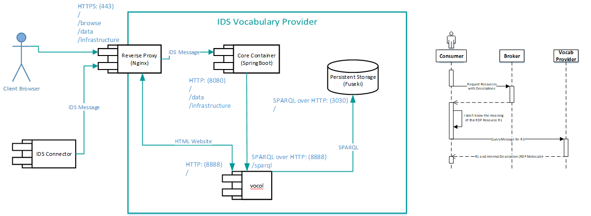

## IDS Vocabulary Provider and It's purpose

IDS vocabulary provider is one of the main components of IDS for the documentation and administration of vocabularies. 
It specifies the content of data packages and resources via using lightweight, external vocabularies and catalogs. 
The IDS vocabulary provider is developed especially for the Plugfest community, not only to store, maintain, document and reuse corresponding concepts, but also their cloud-based creation, maintenance and further development via GIT-based version management systems.




## Running the VocabularyProvider

The steps for bringing up a VocabularyProvider instance depends on the host where it should be deployed. The easiest option is to run the instance on ```localhost```,
which is described in the following. We assume that the Docker command line tools are installed on your system and that you are using a Linux shell.

1. __Pull and build the docker images__: Navigate to ```Idsvocabularyprovider/docker``` and run command from terminal ```./buildImagesLocally.sh```. This will create 4 docker images broker-vocabulary,vocol,fuseki & reverseproxy.
2. __Verify docker images__: To verify 4 images run command ```docker images```. 
3. __Run the instance__: Navigate to ```Idsvocabularyprovider/docker/composefiles``` and run ```docker-compose up```.   

Note: 
The code & image for Vocol is at (https://gitlab.cc-asp.fraunhofer.de/vocoreg/public-ids-vp/vocol)

It is already included in the docker-compose file


## Using the VocabularyProvider

Assuming the vocabularyprovider and its services are running on ```localhost```, it now provides an

* __Interface GUI__, running on the (https://localhost/vocob/)

* __Fuseki__, running on the (https://localhost/fuseki/). 

* __Grafana__, running on the (https://localhost/grafana/). 

Grafana Dashboard configuration file location /docker/grafana/NodeJS-Dashboard.json

To Create an instance you have to navigate to (https://localhost/vocob/) on the browser. The steps are the following:
1. __General Info__: 
      * Name of the vocabulary (e-g generally name of the repository). 
	  * Hosting server address (e-g https://localhost/vocob).
	  * Admin username : your username.
	  * Admin password: your password.

2. __Repository Info__: 
      * URL of the repository (e-g https://github.com/Name/example). 
	  * Repository Owner: From the url (Name).
	  * Repository Name : From the url (example).
	  * Repository Branch : The branch (e-g master).
	  * Username & password: credentials.  

3. __Additional Services__: Select services to include. 

4. __Homepage Description__: Description to show on the homepage of instance. 	  

 

